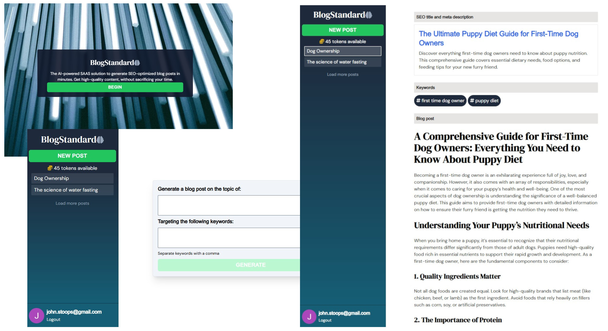

# Blog Standard AI SaaS

> Next JS & Open AI / GPT: Next-generation Next JS & AI apps using MongoDB, Auth0, and Stripe

## Features

- Blog post generation on any topic using OpenAI API
- Search-engine friendly titles
- SEO keyword targeting
- Authentication using Auth0
- Open AI token purchased using Stripe to process payments

Blog Standard uses the following technologies:

- [Next.js](https://nextjs.org/)
- [React](https://reactjs.org/)
- [OpenAI TypeScript and JavaScript API Library](https://github.com/openai/openai-node): This library provides convenient access to the OpenAI REST API from TypeScript or JavaScript.
- [Stripe Node.js Library](https://github.com/stripe/stripe-node): The Stripe Node library provides convenient access to the Stripe API from applications written in server-side JavaScript.
- [MongoDB Node.js Driver](https://www.mongodb.com/): The official MongoDB driver for Node.js.
- [React Markdown](https://github.com/remarkjs/react-markdown): React component to render markdown. This is used to to prevent a user injecting a topic telling it to ignore your instructions you can tell it that it is delimited by triple hyphens or similar.
- [React DOM](https://react.dev/): This package serves as the entry point to the DOM and server renderers for React. It is intended to be paired with the generic React package, which is shipped as react to npm.
- [nextjs-auth0](https://github.com/auth0/nextjs-auth0): The Auth0 Next.js SDK is a library for implementing user authentication in Next.js applications.
- [fortawesome](https://fortawesome.com/): Allows you to load just the icons your website uses
- [Next Font](): Includes built-in automatic self-hosting for any font file. This means you can optimally load web fonts with zero layout shift, thanks to the underlying CSS size-adjust property used.
- [CORS middleware for Micro](https://github.com/possibilities/micro-cors): Simple CORS middleware for Zeit's Micro.
- [Numeral.js](http://numeraljs.com/): A javascript library for formatting and manipulating numbers.
- [Sharp](https://sharp.pixelplumbing.com/): A high speed Node-API module to convert large images in common formats to smaller, web-friendly JPEG, PNG, WebP, GIF and AVIF images of varying dimensions.
